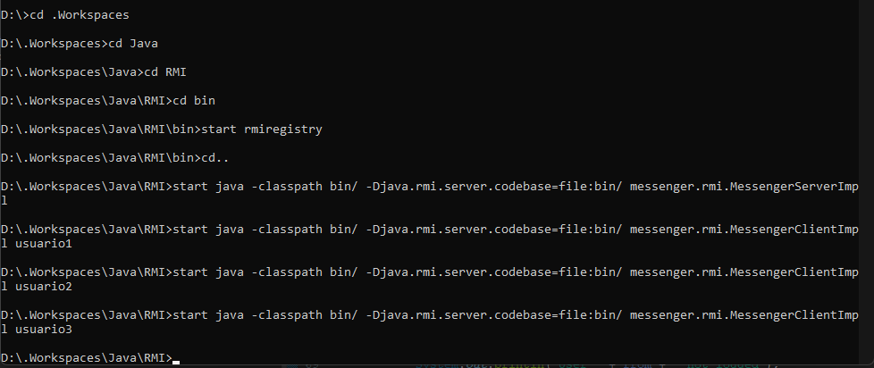
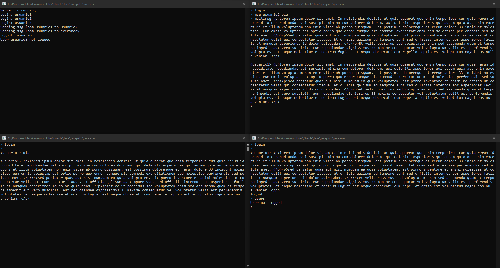

# Messenger-RMI

## Comando para compilar e mandar para diretório bin

Lembrar de ter a váriavel do java configurada nas suas váriaveis de ambiente e no Path

```json
javac MessengerClientImpl.java MessengerServerImpl.java MessengerClient.java MessengerServer.java -d ..\..\..\bin
```

<br>

## Comandos para executar

Inicializar o RMI registry dentro do diretório bin do projeto

```json
start rmiregistry
```

<br>

Voltar para pasta raiz do projeto e inicializar o servidor e os usuários

```json
start java -classpath bin/ -Djava.rmi.server.codebase=file:bin/ messenger.rmi.MessengerServerImpl

start java -classpath bin/ -Djava.rmi.server.codebase=file:bin/ messenger.rmi.MessengerClientImpl usuario1

start java -classpath bin/ -Djava.rmi.server.codebase=file:bin/ messenger.rmi.MessengerClientImpl usuario2
```

<br>

Exemplo na imagem abaixo:



<br>

## Exemplos do servidor com 3 usuários



